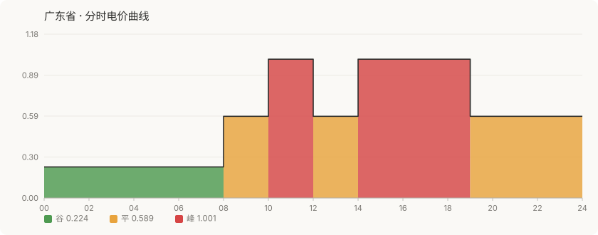
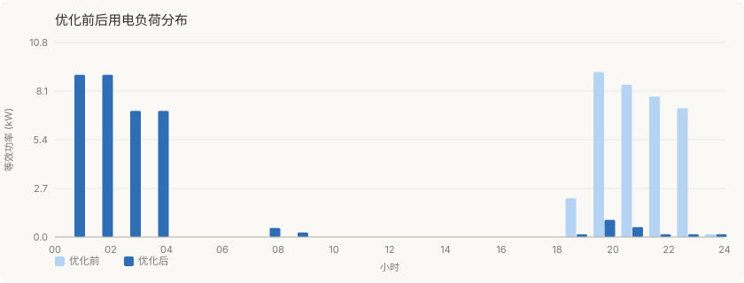

# peak-shift-studio

**用电优化可视化工作台** · 把优化结果变成可读的图表与可分享的报告

[](LICENSE)
[](https://python.org)
[](studio/)
[](output/)

---

## 它做什么

优化结果如果只是一串数字，没人会看。本工具把 `peak-shift-engine` 的 JSON 输出渲染为**三张图 + 一份可离线打开的 HTML 报告**。

### 1. 分时电价曲线

直观呈现一天内峰 / 平 / 谷的分布与价差。颜色遵循「峰暖谷绿」的直觉映射。



### 2. 优化前后负荷分布

对比优化前后每小时用电功率，一眼看出负荷是否成功从峰段转移到谷段。



### 3. 各设备成本对比

逐设备展示优化前后的电费变化与节省金额。


---

## 快速开始

**无需安装任何依赖**（Python 3.8+ 标准库即可）。

```bash
git clone https://github.com/xfnylqt/peak-shift-studio.git
cd peak-shift-studio

# 第 1 步：用引擎产出 JSON
python ../peak-shift-engine/cli.py \
    --tariff ../cn-tou-tariff/data/guangdong.json \
    --preset ev_owner --format json > result.json

# 第 2 步：渲染图表与报告
python cli.py --input result.json --out output --html

# 可选参数
python cli.py --input result.json --out output --title "我的家庭用电方案"
```

产出的 `output/` 目录：

```
output/
├── price_curve.svg     分时电价曲线
├── load_profile.svg    优化前后负荷分布
├── cost_compare.svg    各设备成本对比
└── report.html         完整报告（可直接双击打开 / 分享）
```

---

## 作为库使用

```python
from studio import charts, report

payload = report.load_payload("result.json")

# 单独取某张图
svg = charts.price_curve_svg(report.curve_from(payload), title="广东电价")

# 或一次生成全部
paths = report.write_svgs(payload, "output")
svgs = {k: p.read_text(encoding="utf-8") for k, p in paths.items()}
html = report.html_report(payload, svgs, title="我的用电报告")
```

---

## 架构：为什么与引擎解耦

本仓库**不导入 `peak-shift-engine` 的任何代码**，只消费其 JSON 输出格式：

```
cn-tou-tariff  ──电价数据──▶  peak-shift-engine  ──JSON──▶  peak-shift-studio
   （数据）                      （优化计算）                    （可视化）
```

这样设计的好处：

| 好处 | 说明 |
|---|---|
| 独立安装 | studio 可单独 clone 使用，无需安装引擎 |
| 可替换 | 任何输出同构 JSON 的优化器都能接入 |
| 易测试 | 图表逻辑可用固定 JSON 快照测试，不依赖求解过程 |
| 无循环依赖 | 三个仓库形成单向数据流 |

### 输入 JSON 的关键字段

| 字段 | 用途 |
|---|---|
| `hourly_price` / `hourly_periods` | 96 槽电价曲线（periods 用于着色） |
| `hourly_load_baseline` / `hourly_load_optimized` | 24 小时等效功率 |
| `items[]` | 逐设备的 `cost_before` / `cost_after` / `name` |
| `baseline_total` / `optimized_total` / `saving_pct` | 汇总指标 |

---

## 图表实现说明

- **纯手写 SVG**，不依赖 matplotlib / plotly / cairo 等任何绘图库
- 输出为**矢量图**，任意缩放不失真，适合嵌入 README 与网页
- 配色固定为浅色主题，适配 GitHub 与文档站
- 96 个 15 分钟槽在绘制前会**压缩为连续段**，减少 DOM 节点数量

---

## 输出示例

以广东（峰谷价差全国最大）为例：

| 指标 | 优化前 | 优化后 |
|---|---|---|
| 单次成本 | ¥21.41 | ¥8.72 |
| 整体降幅 | — | **59.3%** |
| 预计年省 | — | **¥4,619** |

电动汽车慢充由 19:00 移至 00:00–04:00，单次节省 ¥10.22。

---

## 已知局限

1. 图表为**静态 SVG**，无交互（悬停、缩放）
2. 配色为固定浅色主题，暂不支持深色模式切换
3. 未做移动端窄屏的自适应重排（依赖外层容器的宽度缩放）

---

## 许可证

[MIT](LICENSE)
